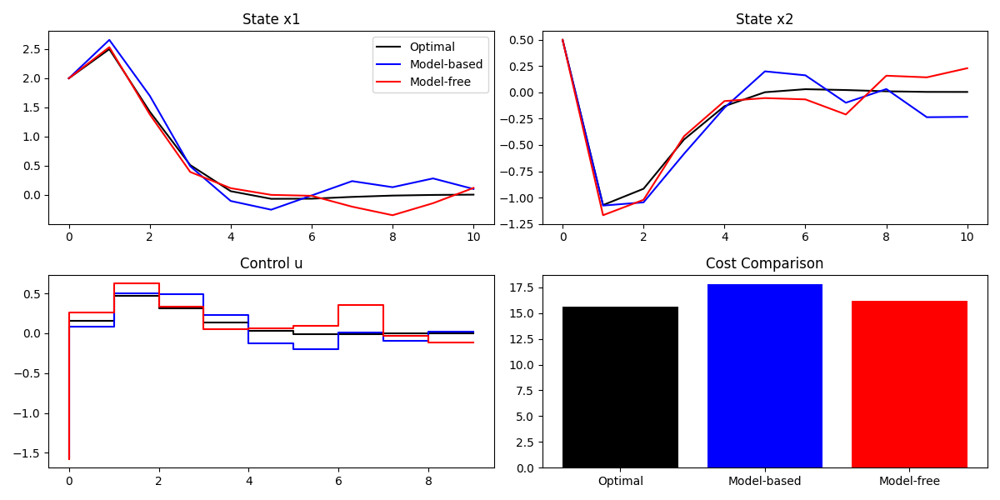

# RL Testing for Linear System Theory

Reinforcement Learning experiments comparing model-based and model-free approaches for LQR (Linear Quadratic Regulator) control problems. Developed for EE 221A (Linear System Theory) at UC Berkeley.

## Overview

This repository implements and compares three control strategies for finite-horizon LQR problems:

1. **Optimal LQR** - Dynamic programming via backward Riccati recursion (baseline)
2. **Model-Based RL** - Learn system dynamics via least squares, then solve LQR
3. **Model-Free RL** - Direct policy optimization via policy gradient

## System Dynamics

**Double Integrator System:**
- State dynamics: `x[k+1] = A x[k] + B u[k] + w[k]`
- System matrices:
  - `A = [[1, 1], [0, 1]]` (discrete-time double integrator)
  - `B = [[0], [1]]`
  - Process noise: `w ~ N(0, 0.01*I)`

**Cost Function:**
- Stage cost: `x'Qx + u'Ru`
- Terminal cost: `x_N'Sx_N`
- Horizon: `N = 10` time steps

## Files

- **`RL_testing.py`** - Comprehensive experiments with multiple trials and sample efficiency analysis
- **`pain.py`** - Streamlined comparison with visualization
- **`Figure_1.png`** - Example output showing trajectory and cost comparisons

## Results

### Performance Comparison

| Method | Typical Cost | Sample Efficiency |
|--------|-------------|-------------------|
| Optimal LQR | ~15.6 | N/A (requires model) |
| Model-Based RL | ~15.9-16.3 | **High** (500 samples → near-optimal) |
| Model-Free RL | ~55-247 | Low (needs many iterations) |

### Key Findings

**Model-Based RL:**
- Achieves **near-optimal performance** (<5% gap) with just 500 data samples
- Model errors: `||A - Â|| ≈ 0.003`, `||B - B̂|| ≈ 0.005`
- **Highly sample-efficient** for structured control problems

**Model-Free RL:**
- Struggles with sample efficiency despite adaptive learning rate and gradient clipping
- Finite-difference policy gradients are noisy and high-variance
- Demonstrates the challenge of model-free methods for control tasks

## Usage

### Basic Comparison

```bash
python pain.py
```

This runs all three methods and displays:
- State trajectories (x₁ and x₂)
- Control inputs over time
- Cost comparison bar chart

### Comprehensive Experiments

```bash
python RL_testing.py
```

This performs:
- Multiple trials with statistical analysis (mean ± std)
- Sample efficiency experiments (50-1000 samples)
- Model error tracking

## Implementation Details

### Model-Based RL
- **Data collection**: Random exploration with `u ~ N(0, σ²)`
- **Learning**: Least squares regression on `[x, u] → x_next`
- **Control**: Solve Riccati recursion with learned `(Â, B̂)`

### Model-Free RL
- **Method**: Finite-difference policy gradient
- **Policy**: Time-varying linear gains `K[k]`
- **Stabilization**: Adaptive learning rate, gradient clipping, best-policy tracking
- **Challenges**: High variance, slow convergence

### Optimal LQR (Baseline)
- **Method**: Backward Riccati recursion
- **Equation**: `P[k] = Q + A'P[k+1](A - B K[k])`
- **Gain**: `K[k] = (R + B'P[k+1]B)⁻¹(B'P[k+1]A)`

## Dependencies

```bash
pip install numpy scipy matplotlib
```

## Example Output



The figure shows:
- **Top left**: Position trajectory (x₁) - all methods converge to zero
- **Top right**: Velocity trajectory (x₂) - smooth regulation
- **Bottom left**: Control effort (u) - model-free starts aggressive, converges
- **Bottom right**: Cost comparison - model-based nearly matches optimal

## Insights

1. **Model structure matters**: For linear systems, learning the model is far more sample-efficient than learning the policy directly

2. **Finite-horizon vs infinite-horizon**: This implementation uses finite-horizon LQR with time-varying gains

3. **Stability is critical**: Model-free methods require careful initialization with stabilizing gains

4. **Practical takeaway**: For control problems with known structure (linear dynamics), model-based RL is the clear winner

## License

MIT License - see LICENSE file for details

## Author

Developed for UC Berkeley EE 221A (Linear System Theory), Fall 2025
